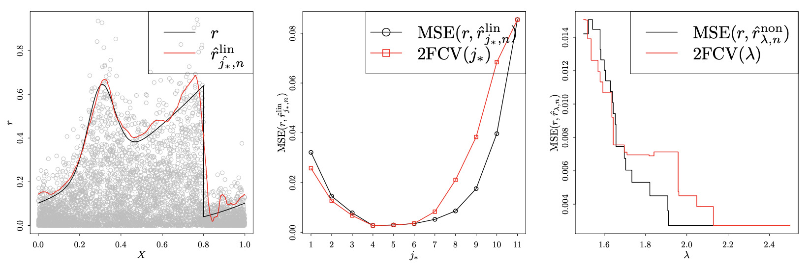

## Additive and multiplicative wavelet regression

This is the code to reproduce all the experiments presented in the paper

**C. Chesneau,  S. El Kolei, J. Kou and F. Navarro
 
[Nonparametric estimation in a regression model with additive and multiplicative noise. Journal of Computational and Applied Mathematics, Vol. 380, 2020.](https://www.sciencedirect.com/science/article/abs/pii/S0377042720302624)**
 

### Requirements
* [rwavelet](https://github.com/fabnavarro/rwavelet)

Copyright (c) 2020 C. Chesneau, S. El Kolei, J. Kou and F. Navarro
